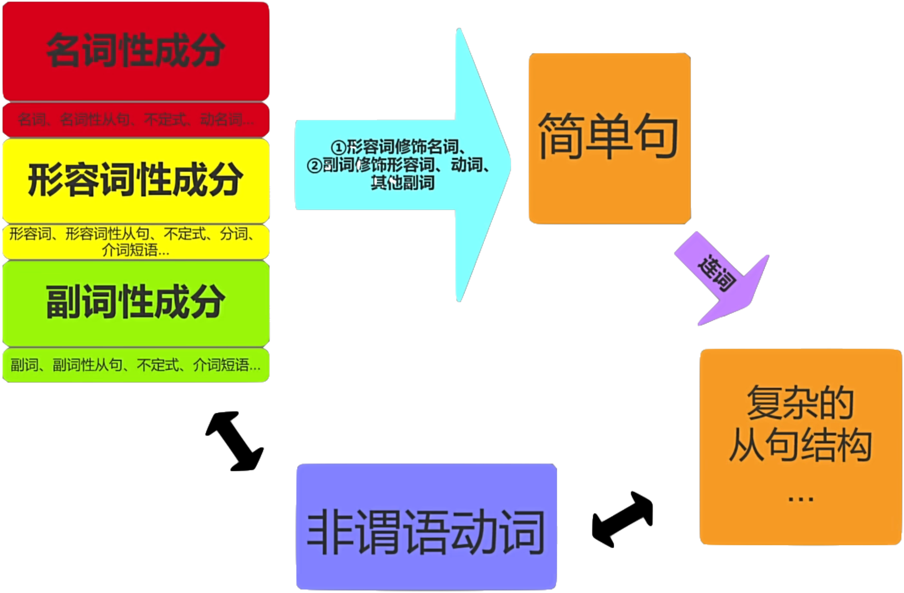

# 英语语法

## 词性

换一种方式理解词性

### 名词、形容词和副词

名词性成分、形容词性成分、副词性成分，这就是一切！整个英语语法的核心就是这三种词性成分。这是一切语法的起点，见上面的英语语法框架图。

- 名词性成分包含：名词、名词性从句、不定式、动名词
- 形容词成分包含：形容词、形容词性从句、不定式、分词、介词短语
- 副词性成分包含：副词、副词性从句、不定式、介词短语

英语语法学的好不好，以新概念三的第一篇课文为例，能够把整个文章标出三种颜色（三种词性），就算过关。

11 种常用词性

- 名词（Noun）
- 动词（Verb）
- 形容词（Adjective）
- 副词（Adverb）
- 代词（Pronoun）
- 介词（Preposition）
- 连词（Conjunction）
- 感叹词（Interjection）
- 冠词（Article）
- 数词（Numeral）
- 限定词（Determiner）（some, any...）

这 11 种常用词性，最终会划分成三大类：名词性成分、形容词性成分和副词性成分

### 词性的修饰关系

英语和汉语的区别。

- 英语是树形结构，汉语是竹形结构。
- 汉语的语法宽松，自由度比较高，一节一节的说下去就行，组织结构没有那么严密。
- 英语的结构更复杂一些，它的语法结构比汉语更严格，更有组织性。
- 写英语文章容易犯的问题，就是一逗到底或者 and，就是在用竹形结构写英语。

1. 形容词性成分修饰名词性成分

- The beautiful flowers have a sweet fragrance.

2. 副词性成分修饰形容词性成分、动词和其他副词性成分

- Her performance was surprisingly good.
- He runs slowly.
- She speaks very softly.

- 形容词性成分修饰名词性成分：**定语**

  - The beautiful flowers have a sweet fragrance.(形容词)
  - The flowers which are stolen from Michael have a sweet fragrance.(形容词性从句)
  - The flower stolen from Michael have a sweet fragrance.(分词)
- 副词性成分修饰形容词性成分：**状语**
  - Her performance was surprisingly good.(副词)
  - Her performance was good when her mom is around.(副词性从句)(状语从句)
- 副词性成分修饰动词**状语**
  - He runs slowly.(副词)
  - He runs if he is fillowed.(副词性从句)
- 副词性成分修饰其他副词成分**状语**
  - She speaks very softly.(副词)
  - She speaks like a gun.(副词性介词短语)

### 介词其实很简单

**介词=形容词or副词**

THe puma is _up_ a tree.【介词】

He looked _up_.【副词】

Prices(价格.n) are _up_.【形容词】

It depends _on_ what they do.【介词】

The car stopped and then drove _on_.【副词】

The TV(.n) is _on_.【形容词】

**介词只有一种用法：介词+名词性成分=介词短语**
- The cat _on_ the table is named Floppy.【名词短语】
- He walked _though_ the park.【名词短语】
- She apologized _for_ arriving late to the meeting.【分词短语】
- She's not certain _about_ whether she'll go to the party or not.【名词性从句】

1. 形容词属性的介词短语

形容词属性的介词短语一般用作**后置定语**，用来**修饰名词**

- The book _on the shelf_ is great.(后置定语)
- I have the hot summers _in Changsha_.(后置定语)

2. 副词属性的介词短语

副词属性的介词短语用于**修饰动词、形容词、以及其他副词**

1. 修饰动词
- We went to a movie _after dinner_.
- They have classes _at our local school_.

2. 修饰形容词
- I am ready _for dinner_.
- Sally is happy _with her new teacher_.

3. 修饰其他副词
- We got there late _in the evening_.
- Our team scored early _in the first quarter_.

**介词**

- 简单介词：as,at,by,during,with...
- 分词介词：considing,including,given,granted...
- 短语介词：ahead of,next to,because of,owning to,along with,as well as,in case of,in change of,in common with,as a result of,in the absence of,to the best of,with an eye to...

## 简单句

理解了简单句，你就理解了一切。

### 主谓宾定状补

1. 主语(Subject) (名词属性)
2. 谓语(Predicatr)(名词属性)
3. 宾语(Object)(名词属性)
4. 定语(Attributive)(形容词属性)
5. 状语(Adverbial)(副词属性)
6. 补语(Complement)(形容词、名词属性)

### 简单句的构成

### 语法分析实践（1）

## 从句

从句 = 连词 + 简单句
从句是简单句的嵌套

### 并列句

并列句 = 简单句 + 简单句，必须有连词

### 名词性从句

### 形容词性从句

也叫定语从句。

### 副词性从句

也叫状语从句。

## 非谓语动词

非谓语动词和从句时一回事，非谓语动词和从句可以互相转换。

### 不定式

### 动名词

### 分词

### 非谓语动词和从句的相互转换

## 语法分析实践

### 语法分析实践（2）

### 语法分析实践（3）

