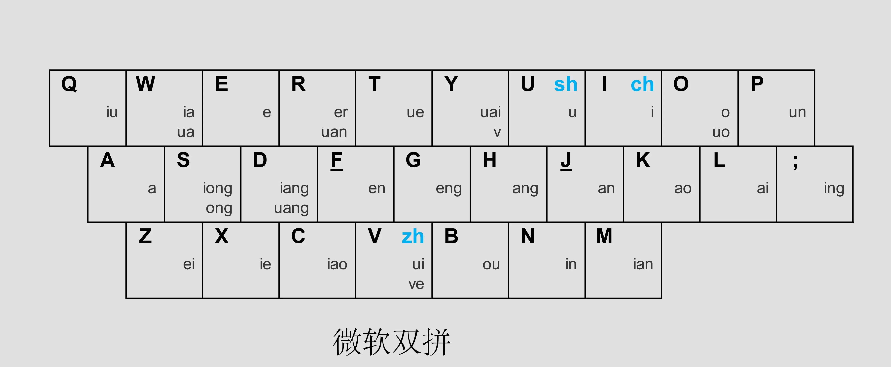

# 微软双拼输入法

## 目标

- 提高汉字输入效率
- 只要能用双拼盲打输入汉字即可，不用追求速度
- 速度是熟练或长期使用后的结果

## 英文盲打

- 购置机械键盘，不要在笔记本电脑的键盘上练习盲打
- 实现英文盲打输入，不用考虑速度，只要能盲打即可
- [打字练习网站](https://dazi.91xjr.com/)
- 首先练习：a-z 26 个字母盲打输入
- 其次练习：标点符号的盲打输入
- 最后练习：0-9 数字和数字键上的标点符号
- 在具备英文盲打的基础上，开始练习双拼输入法

## 微软双拼键位图

## 声母键位

| 声母 | 键位 |
|------|------|
| zh   | V |
| ch   | I |
| sh   | U |

## 韵母键位

| 韵母 | 键位 |
|------|------|
| iu | Q |
| ia, ua    |W |
| er, uan   |R |
| ue        |T |
| v, uai    |Y |
| uo        |O |
| un        |P |
| iong, ong |S |
| iang, uang|D |
| en   |F |
| eng  |G |
| ang  |H |
| an   |J |
| ao   |K |
| ai   |L |
| ing  |; |
| ei   |Z |
| ie   |X |
| iao  |C |
| ui, ve   |V |
| ou   |B |
| in   |N |
| ian  |M |
